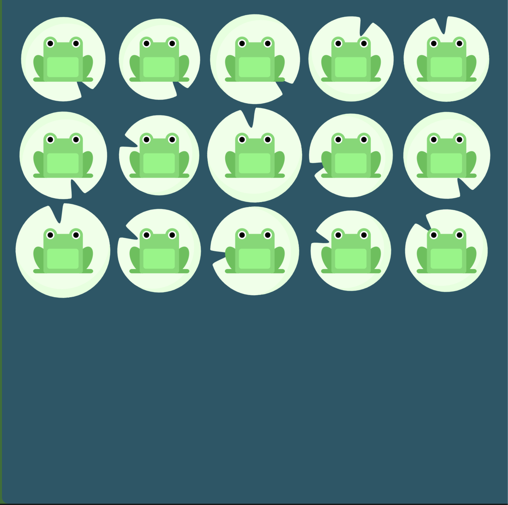

# CSS/SCSS Layout: Flexbox & Grid

- CSS flex box appeared in context of solving manual positioning of boxes
- It's important to understand what problem that the technology has solved, instead of just learning stuff what other people think is valuable.

## Flexbox

### [🐸 Practice at flexboxfroggy! 🐸](https://flexboxfroggy.com/)

- Only talk to the flexbox container outside, don't talk to the children. 
- Direct father controls the positioning of the children content
  ex) .wrapper is father of .box

### [Flex-direction and axis](https://developer.mozilla.org/en-US/docs/Web/CSS/CSS_Flexible_Box_Layout/Ordering_Flex_Items)

```css
.father {
	display:flex 
}
```

display flex sets default flex-direction as row

### **When flex-direction is row,**

```css
.father {
	display:flex;
  flex-direction: row;
}
```


- Main axis is x-axis
  - justify-content move childrens on main axis (= justify-content modify lines of main axis)


- Cross axis is y-axis
  - align-items move children on cross axis (= align-items modify lines of cross axis)

### **When flex-direction is column,**

```css
.father {
	display:flex;
  flex-direction: column;
}
```


- Main axis is y-axis
  - justify-content move childrens on main axis (= justify-content modify lines of main axis)


- Cross axis is x-axis
  - align-items move children on cross axis (= align-items modify lines of cross axis)
  
- justify-content & align-items can be used in any elements: it affects subordinated children elements. 

### When flex-direction is row-reverse ( or column reverse)

```css
.father {
	display:flex;
  flex-direction: row-reverse;
 	/*flex-direction: column-reverse;*/
}
```

- Axis layout is the same. 
- Only left-to-right sequential arraying is reversed as right-to-left.

### [align-self](https://developer.mozilla.org/en-US/docs/Web/CSS/align-self)

```css
.father {
	display:flex;
  flex-direction: flex-start;
}

.yellow{
  align-self: flex-end;
}
```

- Overrides father flexbox's align-items
- Child element will move along cross axis


### align-content

```css
.father {
  display:flex;
  flex-wrap: wrap;
  align-content: space-between
}
```

- **aligning lines (of frogs)** along cross axis



### order

```css
/* right */
.child {
  background: peru;
  order: 1;
}

/* left */
.child:nth-child(2) {
  order: -1;
}

/* middle */
.child:nth-child(3) {
  order: 0;
}
```

- flexbox order is **sequentially assigning children itself** along main axis of father flexbox.
- default is 0
- comparing orders like 0<1 or -1<0 will shift the elements along the main axis of father flexbox.

### [flex-wrap](https://developer.mozilla.org/en-US/docs/Web/CSS/flex-wrap)

```css
.father {
  flex-wrap: wrap
}
```

- wrap means keep the size of the children, when window ran out of spaces
- wrap also means to make multiple lines along father flexbox's main axis
- flex-wrap: wrap-reverse; is reverse direction of main axis
- default value is nowrap
- nowrap means cram everyting in one father (line), even if sizes of children are shrunk

### flex-shrink

```css
.father {
	flex-wrap: nowrap;
}

.child{
  flex-shrink: 2;
}
```

- enabled only when father doesn't respect the size of children
- kicks in when window ran out of spaces, along the main-axis
- default value is 1
- flex-shrink value 2 means it is 200% more likely to shrink than the other children

### flex-grow

```css
.child{
  flex-grow: 1;
}

.child:nth-child(2) {
  flex-grow: 2;
}

.child:nth-child(3) {
  flex-grow: 1;
}
```

- enabled regardless of flex-wrap.
- flex-grow takes the space that is available to grow in the window, along the main-axis

- default value is 0, which means that child will keep its size, doesn't take space that is available to grow
- flex-grow value 1 and 2 is proportional to each other: it grows twice more than the other children

### [flex-basis](https://developer.mozilla.org/en-US/docs/Web/CSS/flex-basis)

```css
.father {
  display: flex;
  flex-direction: row;
  width: 100wh;
}

.child {
  flex-basis: 30%;
  /* flex-basis: 100px; */
}
```

- Sizing element along the main-axis of the father flexbox
- flex-basis % is percentage of size of father flexbox
  ex: if father flexbox width is 100wh and if child's flex-basis is 30%, then size of the child will be 30wh
- You can also give fixed pixel values to the child box


## Grid

```css
.father {
  display: grid;
}
```

- usually talking to father, not to children
- Making table - like grid layout

### Grid-template-rows, Grid-template-columns, Grid column-gap, Grid row-gap

```css
.grid{
	display: grid;
  grid-template-columns: 250px 250px 250px;
  grid-template-rows: 100px 50px 300px;
  column-gap: 5px;
  row-gap: 10px;
}
```


### Grid Template Areas 

```css
.grid {
  display: grid;
  grid-template-columns: repeat(4, 200px);
  grid-template-rows: 100px repeat(2, 200px) 100px;
  grid-template-areas:
    "header header header header"
    "content content . nav"
    "content content . nav"
    "footer footer footer footer";
}

.header {
  background-color: gold;
  grid-area: header;
}

.content {
  background-color: greenyellow;
  grid-area: content;
}

.nav {
  background-color: orange;
  grid-area: nav;
}

.footer {
  background-color: purple;
  grid-area: footer;
}
```

- Matching grid-area value to grid-template-areas value in father. NOT BY CLASS NAMES!

### grid-column and grid-row

```css
.grid {
  display: grid;
  gap: 10px;
  grid-template-columns: repeat(4, 100px);
  grid-template-rows: repeat(4, 100px);
}

.header {
  background-color: gold;
  grid-column-start: 1;
  grid-column-end: 5;
}

.content {
  background-color: greenyellow;
  grid-column-start: 1;
  grid-column-end: 4;
  grid-row-start: 2;
  grid-row-end: 4;
}

.nav {
  background-color: orange;
  grid-row-start: 2;
  grid-row-end: 4;
}

.footer {
  background-color: purple;
  grid-column-start: 1;
  grid-column-end: 5;
}
```


- stretching elements from (#white-line-number) to (#white-line-number)

## Concepts

- [x] flex-direction
- [x] order
- [x] justify-content
- [x] align-items
- [x] align-self
- [x] flex-wrap
- [x] align-content
- [x] flex-grow
- [x] flex-shrink
- [x] flex-basis

## Grid:

- [x] grid-template-columns
- [x] grid-template-rows
- [x] column-gap
- [x] row-gap
- [x] gap
- [x] grid-template-areas
- [ ] grid-column-start
- [ ] grid-column-end
- [ ] grid-row-start
- [ ] grid-row-end
- [ ] grid-column
- [ ] grid-row
- [ ] grid-template
- [ ] justify-items
- [ ] align-items
- [ ] place-items
- [ ] justify-content
- [ ] align-content
- [ ] place-content
- [ ] justify-self
- [ ] align-self
- [ ] place-self
- [ ] grid-auto-rows
- [ ] grid-auto-flow
- [ ] grid-auto-columns

### Keywords & Functions:

- [ ] repeat
- [ ] fr
- [ ] minmax
- [ ] auto-fit
- [ ] auto-fill
- [ ] min-content
- [ ] max-content

## SCSS:

- [ ] Variables
- [ ] Nesting
- [ ] Mixins
- [ ] Extend
- [ ] Responsive Mixins

## To Clone:

- [ ] [https://besthorrorscenes.com/](https://besthorrorscenes.com/)
- [ ] [https://paint-box.com/](https://paint-box.com/)
- [ ] [http://10x19.co/](http://10x19.co/)
- [ ] [http://www.z-o-o.fr/](http://www.z-o-o.fr/) -> Referencing this website for FitCuration
- [ ] [https://schwartzmedia.com.au/](https://schwartzmedia.com.au/)
- [ ] [https://tolv.dk/](https://tolv.dk/)
- [ ] [https://rodicdavidson.co.uk/](https://rodicdavidson.co.uk/)
- [ ] [https://beige.de/](https://beige.de/)
- [ ] [http://donicaida.com/](http://donicaida.com/)
- [ ] [https://canalstreet.market/](https://canalstreet.market/)
- [ ] [https://wonhundred.com/](https://wonhundred.com/)


## My Questions

- [CSS Units - What is the difference between vh/vw and %?](https://stackoverflow.com/questions/31039979/css-units-what-is-the-difference-between-vh-vw-and)]

